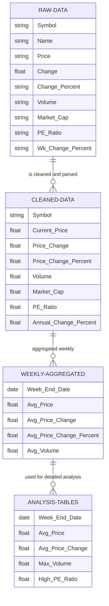

# Analysis of Daily Stock Gainers

## Introduction
This report presents the findings from the analysis of daily stock gainers listed on Yahoo and Wall Street Journal’s news websites. The primary goal was to analyze a week’s worth of stock market data to identify key trends and patterns that can inform investment decisions and provide insights to non-financial stakeholders. This analysis helps in understanding the behavior of stocks that have shown significant upward movements in their prices.

## Use Cases
The analysis focuses on several practical use cases:

- **Identifying Recurring Stocks**: Highlighting stocks that frequently appear, which may indicate consistency in performance or volatility.
- **Examining Price Ranges**: Understanding the distribution of price changes and their percentages to gauge market trends and stock volatility.
- **Pattern Recognition**: Investigating any discernible patterns in the appearance of gainers to predict future trends.

## Methods
The dataset consisted of daily records of stock prices, including open, midday, and closing prices. The data was processed using SQL queries and DBT (Data Build Tool) to create intermediate tables that facilitated deeper analysis. Weekly aggregations were performed to simplify the data for trend analysis and to create visual representations of these trends.

### Data Processing Steps Included:
1. **Creation of Daily and Weekly Tables**: Python scripts were used to collect and store daily data and aggregate it on a weekly basis.
2. **Analysis of Repeating Symbols**: SQL queries identified symbols that appeared frequently within the dataset.

## Entity Relationship Diagram (ERD)
Reason for this design because it gives a flow of data from raw stock information to actionable insights. The RAW-DATA table captures all the detailed stock information initially, which is then cleaned and transformed into CLEANED-DATA for consistency and accuracy. Aggregating the data weekly in the WEEKLY-AGGREGATED table allows for easier trend analysis over time, smoothing out daily volatility. Finally, the ANALYSIS-TABLES provide detailed insights, such as identifying stocks with the highest volume or strongest performance, helping in making informed investment decisions. This structure ensures that stakeholders—whether investors, analysts, or risk managers—can efficiently access and use the data that’s most relevant to their needs.

Below is the ERD that illustrates the flow and transformation of the data:

## Summary
While the data provides useful insights, additional data, such as company news and long-term data, could offer more detailed information. Overall, the data helps understand stock performance and can guide investment decisions, but more advanced methods could improve the analysis further.
