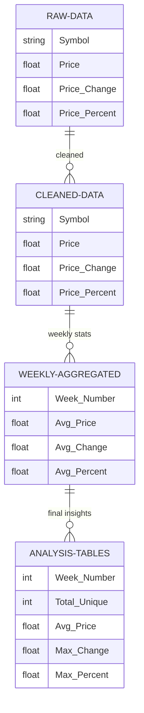

# Analysis of Daily Stock Gainers

## Introduction
This report presents the findings from the analysis of daily stock gainers listed on Yahoo and Wall Street Journal’s news websites. The primary goal was to analyze a week’s worth of stock market data to identify key trends and patterns that can inform investment decisions and provide insights to non‑financial stakeholders. This analysis helps in understanding the behavior of stocks that have shown significant upward movements in their prices.

## Use Cases
- **Identifying Recurring Stocks** – stocks that frequently appear, indicating momentum or volatility.  
- **Examining Price Ranges** – distribution of price changes and percentages to gauge market trends.  
- **Pattern Recognition** – spotting patterns in how often gainers appear to predict future trends.

## Methods
Daily gainer CSV files were combined, cleaned, and aggregated weekly using SQL (executed via DBT). Key steps:

1. **Create raw tables** for WSJ and Yahoo gainers.  
2. **Clean & standardize** columns (SYMBOL, PRICE, PRICE_CHANGE, PRICE_PERCENT_CHANGE).  
3. **Weekly aggregation** to get averages and extremes.  
4. **Repeat‑symbol analysis** to find momentum stocks.  
5. **Final summary tables** for reporting.

## Entity Relationship Diagram (ERD)


## Key SQL Snippets
```sql
-- Raw tables
CREATE OR REPLACE TABLE RAW_WSJ (...);
CREATE OR REPLACE TABLE RAW_YAHOO (...);

-- Weekly aggregation
CREATE OR REPLACE TABLE WEEKLY_AGG_WSJ AS
SELECT 13 AS Week_Number,
       AVG(PRICE)  AS Avg_Price,
       AVG(PRICE_CHANGE) AS Avg_Change,
       AVG(PRICE_PERCENT_CHANGE) AS Avg_Percent
FROM RAW_WSJ;

-- Final summary
CREATE OR REPLACE TABLE FINAL_SUMMARY_WSJ AS
SELECT 13 AS Week_Number,
       COUNT(DISTINCT SYMBOL) AS Total_Unique,
       AVG(PRICE) AS Avg_Price,
       MAX(PRICE_CHANGE) AS Max_Change,
       MAX(PRICE_PERCENT_CHANGE) AS Max_Percent
FROM RAW_WSJ;
```

## Findings  

### Wall Street Journal (WSJ)

| Metric               | Value                          |
|----------------------|--------------------------------|
| Total rows           | 2 100                          |
| Unique stocks        | 839                            |
| Repeated symbols     | 513                            |
| Top 5 repeats        | ALMS, PHH, USAR, LGHL, XGN     |
| Avg price            | \$27.79                        |
| Avg daily change     | \$2.12 (+12.4 %)               |
| Max price change     | \$178.32 (+735 %)              |

### Yahoo Finance

| Metric               | Value                          |
|----------------------|--------------------------------|
| Total rows           | 984                            |
| Unique stocks        | 438                            |
| Repeated symbols     | 213                            |
| Top 5 repeats        | COOP, RKT, VIV, IONQ, AEO      |
| Avg price            | \$94.75                        |
| Avg daily change     | \$4.20 (+5.26 %)               |
| Max price change     | \$415.52 (+109 %)              |

### Summary
Over the study week, WSJ’s daily gainer list highlighted mostly lower-priced, fast-moving stocks, whereas Yahoo’s list focused on higher-priced names with steadier moves. Repetition analysis uncovered 513 recurring symbols on WSJ (over half its unique tickers) and 213 on Yahoo, indicating strong momentum plays on both platforms. Average prices and percentage gains show that WSJ gainers delivered larger relative jumps, but Yahoo gainers represented greater absolute dollar moves. Together, these insights can guide traders toward the most active tickers and help non-financial stakeholders understand where the market’s attention is concentrated. Future refinements—such as layering in news sentiment, sector tags, and candlestick history—could improve signal quality and support more sophisticated trading or risk-management strategies.

